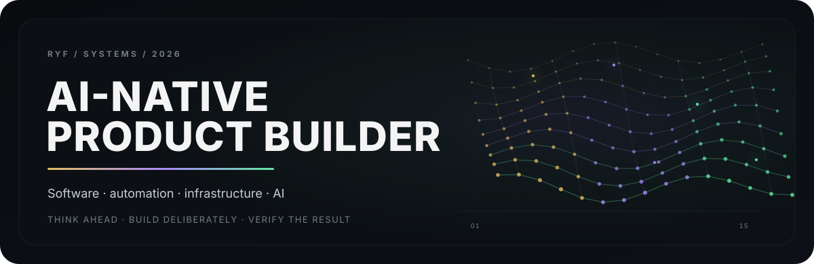

<picture>
  <source media="(prefers-color-scheme: dark)" srcset="./assets/hero-dark.svg">
  <source media="(prefers-color-scheme: light)" srcset="./assets/hero-light.svg">
  
</picture>

<p align="center">
  <strong>AI-native product builder</strong><br>
  Building software, automation, and engineering systems with AI.
</p>

<p align="center">
  <code>TypeScript</code> · <code>React</code> · <code>Node.js</code> · <code>Cloudflare</code> · <code>GitHub Actions</code> · <code>Windows</code> · <code>PowerShell</code>
</p>

---

## Build

I explore how far a small team — or one person — can go by combining **software engineering, automation, self-hosted infrastructure, and AI agents**.

The public repositories here are intentionally separated from private product and production systems. They contain reusable ideas, experiments, and learning material — not customer data, credentials, production configuration, or proprietary product implementation.

<p>
  <a href="https://github.com/ryf-build/windows-ai-dev-team">
    
  </a>
  <a href="https://github.com/ryf-build/ai-development-playbook">
    
  </a>
</p>

<p>
  <a href="https://github.com/ryf-build/ryf-labs">
    
  </a>
</p>

## Engineering activity

High-volume engineering work happens across both public experiments and private production repositories. Private work stays private; only contribution activity may be reflected here.


## Writing

### 1台のWindows PCをAI開発チームにする

A practical project about turning a single Windows machine into an AI-assisted development environment: GitHub, self-hosted runners, automation, QA, and human-controlled AI workflows.

→ **[Companion repository: windows-ai-dev-team](https://github.com/ryf-build/windows-ai-dev-team)**

## Working principles

```text
AUTOMATE WHAT REPEATS.
VERIFY WHAT MATTERS.
KEEP HUMAN AUTHORITY EXPLICIT.
SHIP REAL SYSTEMS.
```

## Public toolchain

```text
TypeScript   React        Node.js       Cloudflare
GitHub       Actions      PowerShell    Windows
Python       Git          CI/CD         AI Agents
```

---

<p align="center"><strong>KEEP BUILDING.</strong></p>

<picture>
  <source media="(prefers-color-scheme: dark)" srcset="./assets/github-snake-dark.svg">
  <source media="(prefers-color-scheme: light)" srcset="./assets/github-snake.svg">
  
</picture>
