  Live visuals use public GitHub data only. Private product and production repositories stay private.

## Live system

## Operating model

  Human intent sets goals, constraints, and authority. AI accelerates exploration and implementation. Work is reviewed, tested, automated where repeatable, and only then shipped as reusable public output.

## Selected work

  
  

## Writing

---

  <strong>THINK AHEAD · BUILD DELIBERATELY · VERIFY WHAT MATTERS</strong> 
  Public telemetry refreshes every 6 hours.

