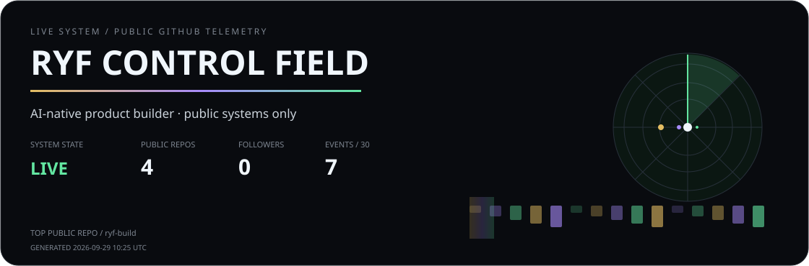
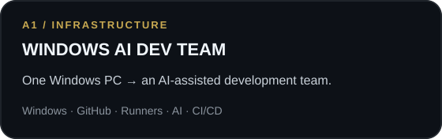
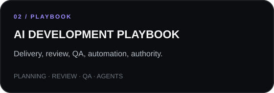
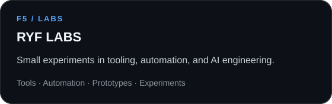
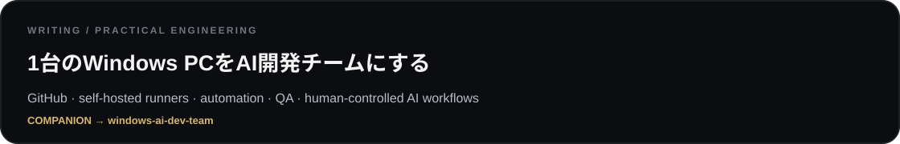

  Live visuals use public GitHub data only. Private product and production repositories stay private.

## Live system

  <strong>MOVE THE SIGNAL</strong> 
  <a href="https://github.com/ryf-build/ryf-build/issues/new?title=profile-move%3A%20A1&body=MOVE%3DA1"><code>A1</code></a>
  ·
  <a href="https://github.com/ryf-build/ryf-build/issues/new?title=profile-move%3A%20C3&body=MOVE%3DC3"><code>C3</code></a>
  ·
  <a href="https://github.com/ryf-build/ryf-build/issues/new?title=profile-move%3A%20F5&body=MOVE%3DF5"><code>F5</code></a>
  ·
  <a href="https://github.com/ryf-build/ryf-build/issues/new?title=profile-move%3A%20H7&body=MOVE%3DH7"><code>H7</code></a>

  Each move opens a public Issue. A bounded Action accepts only A1, C3, F5, or H7, updates the signal, then closes the Issue.

## Selected work

  
  

## Writing

---

  <strong>THINK AHEAD · BUILD DELIBERATELY · VERIFY WHAT MATTERS</strong> 
  Public telemetry refreshes every 6 hours.

