## ♞ Opening / About

I'm **Ryf**, an AI-native product builder.  
I build software, automation, and engineering systems with AI.  
Public repositories contain reusable tools, experiments, and engineering ideas; private product and production systems stay private.

> **A better position tomorrow.**

## ♟ Selected Lines / Selected Work

  
  
  

## ♜ Endgame / Writing

  Animated SVG profile system · refreshed every 6 hours from public GitHub metadata only.

