  Generated every 6 hours from public GitHub metadata. Private product and production work stays private.

## Selected work

**[windows-ai-dev-team](https://github.com/ryf-build/windows-ai-dev-team)**  
Turn one Windows PC into an AI-assisted development team.

**[ai-development-playbook](https://github.com/ryf-build/ai-development-playbook)**  
Practical patterns for AI-native software delivery, review, QA, and automation.

**[ryf-labs](https://github.com/ryf-build/ryf-labs)**  
Small public experiments in developer tooling, automation, and AI-assisted engineering.

## Writing

**[1台のWindows PCをAI開発チームにする](https://github.com/ryf-build/windows-ai-dev-team)**  
GitHub, self-hosted runners, automation, QA, and human-controlled AI workflows.
